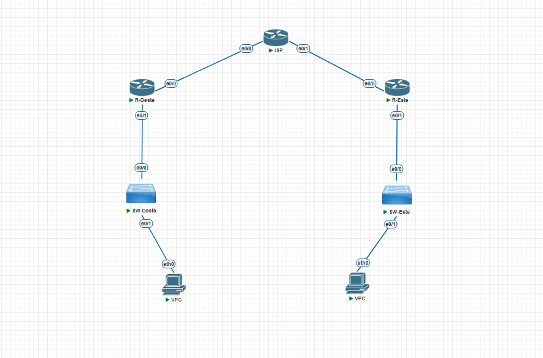
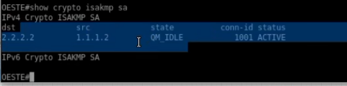
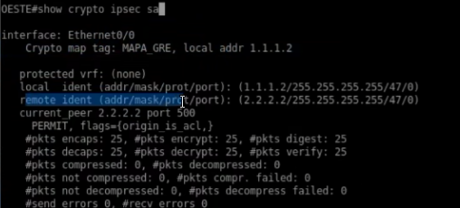
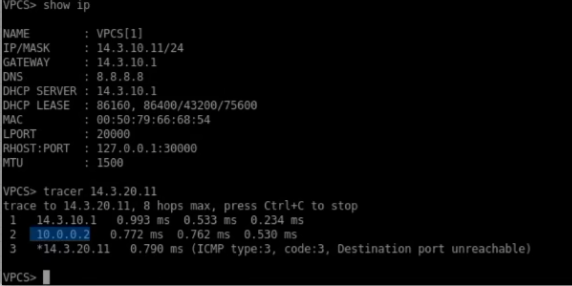

<h1>Instituto Tecnológico de Las Américas (ITLA)</h1>
  
<h2>Configuración y Verificación de VPN Site-to-Site con Túnel GRE sobre IPSec (IKEv1)</h2>

Documentación Técnica Profesional — Práctica 5 (Semana 6)

   

<strong>Estudiante:</strong> Alan Daniel Garcia Mendez 
<strong>Matrícula:</strong> 2025-1403 
<strong>Carrera:</strong> Seguridad Informática 
<strong>Asignatura:</strong> Seguridad de Redes 
<strong>Docente:</strong> Jonathan Esteban Rondon Corniel 
<strong>Fecha de Entrega:</strong> 2 de julio de 2026 
<strong>Video de Exposición:</strong> <a href="https://youtu.be/IevT5CEssRU">https://youtu.be/IevT5CEssRU</a> 
<strong>Repositorio de GitHub:</strong> <a href="https://github.com/imAlanG16/03_ipsec_ikev1_gre_s2s">https://github.com/imAlanG16/03_ipsec_ikev1_gre_s2s</a>

## Objetivo de la VPN
El objetivo de este laboratorio es implementar una VPN de tipo Site-to-Site utilizando un túnel GRE (Generic Routing Encapsulation) protegido mediante el protocolo IPSec coordinado bajo IKEv1. La encapsulación GRE permite unificar el tráfico multiprotocolo y de broadcast/multicast en una única interfaz virtual (`Tunnel0`), permitiendo el uso de enrutamiento dinámico sobre el túnel. Dado que GRE carece de propiedades nativas de cifrado y seguridad, se aplica IPSec en modo transporte (Transport Mode) para cifrar exclusivamente el flujo del túnel GRE que se establece entre los direccionamientos públicos de los routers Oeste y Este, logrando un canal seguro de alta eficiencia.

## Topología de Red y Direccionamiento
La topología física mantiene el esquema de sucursales Oeste y Este interconectadas a través de la nube ISP. A nivel lógico, se introduce la interfaz `Tunnel0` con direccionamiento `10.0.0.0/30` para establecer el canal GRE.

  
  
Topología física Site-to-Site para el túnel GRE

El direccionamiento IP de las interfaces y subredes lógicas del escenario es:

| Dispositivo / Rol | Interfaz | Dirección IP / Subred | Detalles de Configuración |
| :--- | :--- | :--- | :--- |
| **Router OESTE (Peer 1)** | Ethernet0/0 | `1.1.1.2/30` | WAN física hacia ISP |
| | Ethernet0/1 | `14.3.10.1/24` | LAN interna corporativa |
| | Tunnel0 | `10.0.0.1/30` | Source: `Ethernet0/0` / Dest: `2.2.2.2` |
| **Router ESTE (Peer 2)** | Ethernet0/0 | `2.2.2.2/30` | WAN física hacia ISP |
| | Ethernet0/1 | `14.3.20.1/24` | LAN interna corporativa |
| | Tunnel0 | `10.0.0.2/30` | Source: `Ethernet0/0` / Dest: `1.1.1.2` |* Interfaz Tunnel0 (Túnel GRE): `10.0.0.2/30` (Source: `Ethernet0/0`, Dest: `1.1.1.2`)

## Parámetros Criptográficos Utilizados
Los parámetros de encriptación y encapsulación aplicados son:

| Fase | Parámetro | Valor Configurado |
| :--- | :--- | :--- |
| **Fase 1 (ISAKMP)** | Versión IKE | IKEv1 |
| **Fase 1** | Algoritmo de Cifrado | AES-256 |
| **Fase 1** | Función Hash | SHA-256 |
| **Fase 1** | Autenticación / PSK | Pre-share / `CISCO123` |
| **Fase 1** | Grupo Diffie-Hellman | Group 14 (2048-bit) |
| **Fase 2 (IPSec)** | Transform-Set | `TS_GRE_IKEV1` (`esp-aes 256 esp-sha256-hmac`) |
| **Fase 2** | Modo de Operación | Transport Mode (`mode transport`) |
| **Fase 2** | Tráfico Interesante | ACL 110 (Permitir protocolo GRE de WAN a WAN) |
| **Fase 2** | Asociación | Crypto map aplicado en la interfaz WAN externa física |

## Explicación de la Configuración y Scripts
El enrutador OESTE y el enrutador ESTE configuran una interfaz lógica `Tunnel0` utilizando la encapsulación por defecto de GRE. Para asegurar la transmisión del túnel, se define una lista de acceso extendida (número 110) que intercepta específicamente el tráfico del protocolo GRE (`permit gre host 1.1.1.2 host 2.2.2.2`). El transform-set se configura obligatoriamente en modo transporte (`mode transport`), ya que no es necesario añadir una segunda cabecera IP de túnel. Finalmente, se asocia la ACL y el peer al crypto map `MAPA_GRE` y se aplica en la interfaz WAN física. El enrutamiento de las LANs se establece apuntando al extremo del túnel GRE (`ip route 14.3.20.0 255.255.255.0 10.0.0.2`).

Los comandos aplicados completos de este diseño se encuentran en: [script_configuracion.txt](resources/script_configuracion.txt).

## Verificación de Funcionamiento

### 1. Estado de la Negociación ISAKMP SA (Fase 1)
Para verificar la correcta negociación del canal de control entre los peers públicos, se ejecuta el comando `show crypto isakmp sa` en el router `OESTE`. La salida de consola confirma que se ha negociado exitosamente una asociación de seguridad ISAKMP activa hacia el peer público remoto `2.2.2.2` desde la dirección local `1.1.1.2`. 

La SA se encuentra en estado **`QM_IDLE`** y estatus **`ACTIVE`**, validando que la fase 1 del túnel se ha establecido correctamente.

  
  
Asociación ISAKMP activa en el router OESTE con estado QM_IDLE

### 2. Asociación de Cifrado IPSec en el Tránsito GRE (Fase 2)
La comprobación de la Fase 2 se realiza mediante el comando `show crypto ipsec sa` en el router `OESTE`. Al tratarse de una implementación de túnel GRE sobre IPSec mediante crypto maps físicos, la asociación criptográfica matchea exclusivamente el protocolo **GRE (protocolo IP 47)** de forma directa entre los direccionamientos públicos WAN:
* `local ident: (1.1.1.2/255.255.255.255/47/0)`
* `remote ident: (2.2.2.2/255.255.255.255/47/0)`

Esto comprueba que todo el tráfico encapsulado en GRE es capturado y procesado por IPSec en modo transporte en la interfaz física `Ethernet0/0` bajo la firma `MAPA_GRE`. Los contadores reportan un paso de datos bidireccional exitoso y sin pérdidas:
* **`#pkts encaps: 25`** y **`#pkts encrypt: 25`**
* **`#pkts decaps: 25`** y **`#pkts decrypt: 25`**

  
  
Detalles de la SA IPSec protegiendo el protocolo 47 (GRE) de WAN a WAN

### 3. Prueba de Conectividad y Enrutamiento LAN a LAN (Rastreo GRE)
La verificación de extremo a extremo se realiza desde la consola del cliente VPCS en el extremo Oeste. En primer lugar, al ejecutar `show ip`, se verifica que el cliente cuenta con la IP local `14.3.10.11/24` y gateway `14.3.10.1`. 

Posteriormente, al trazar la ruta hacia la LAN remota en el Este (`14.3.20.11`) mediante el comando `tracer 14.3.20.11`, se evidencia el siguiente flujo de enrutamiento:
1. El primer salto va al gateway de la LAN local `14.3.10.1` (interfaz del router Oeste).
2. El segundo salto transita a través de la IP del túnel GRE del extremo remoto **`10.0.0.2`** (interfaz virtual `Tunnel0` del router Este), lo cual confirma que el tráfico LAN es encapsulado de forma transparente en GRE e inyectado al túnel cifrado de IPSec.
3. El tercer salto alcanza al host destino `14.3.20.11`.

  
  
Verificación de enrutamiento en VPCS pasando a través del extremo de túnel GRE 10.0.0.2

